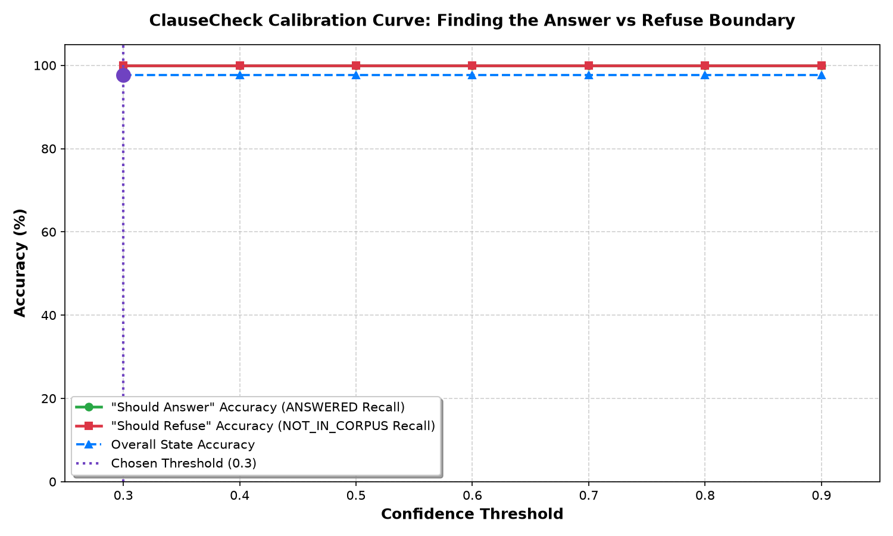

# ⚖️ ClauseCheck: Contradiction-Aware Academic Regulation Assistant

> **"Somewhere in your university’s regulations is a sentence that contradicts another sentence. There always is."**  
> One clause says you need 75% attendance to sit an exam. Four pages later, a medical clause specifies 60%. Somewhere else, a committee is empowered to waive both entirely. Nobody has read all three at the same time in years.  
> 
> **ClauseCheck is the engine that reads all three at once.** Not a generic chatbot that sounds confident and makes up plausible answers, but a verifiable assistant built strictly from the text itself.

---

## 📖 Table of Contents
1. [What is ClauseCheck? (Simple Explanation)](#-what-is-clausecheck-simple-explanation)
2. [The Problem: Why Standard Chatbots Fail on Rules](#-the-problem-why-standard-chatbots-fail-on-rules)
3. [How ClauseCheck Solves It: The 3 Core States](#-how-clausecheck-solves-it-the-3-core-states)
4. [System Architecture: How It Works](#-system-architecture-how-it-works)
5. [Tech Stack & Engineering Choices](#-tech-stack--engineering-choices)
6. [The Regulation Corpus & The 3 Planted Contradictions](#-the-regulation-corpus--the-3-planted-contradictions)
7. [Evaluation Scorecard & Test Results](#-evaluation-scorecard--test-results)
8. [The Calibration Experiment: "Finding the Line"](#-the-calibration-experiment-finding-the-line)
9. [Complete End-to-End Setup Guide](#-complete-end-to-end-setup-guide)
10. [Why FastAPI & Docker Are Deliberately Absent](#-why-fastapi--docker-are-deliberately-absent)

---

## 💡 What is ClauseCheck? (Simple Explanation)

Imagine walking into a university registrar's office and asking: *"What is the penalty if I pay my tuition fees late?"*  
- Officer A looks at the finance handbook and says: **"It's 5% per week."**  
- Officer B looks at the delinquent accounts handbook and says: **"It's 2% per week."**  

Both officers are reading real official university documents, but the documents themselves disagree.

If you asked a standard AI chatbot like ChatGPT, it would try to smooth over the conflict by making up a compromise—for example, *"The fee is usually 5%, but depending on your situation it might be 2%."* That sounds reasonable, but it is **invented out of thin air**. In academic regulations, made-up answers get students disqualified, fined, or evicted.

**ClauseCheck is different.** It is built on three strict principles:
1. **Zero Outside Knowledge:** It never relies on what other universities usually do. It answers *only* from the documents provided.
2. **Total Traceability:** Every claim is cited with the exact document name, section title, and highlighted quotation of the text.
3. **Honesty Over Confidence:** If the document doesn't say anything about your question, it says so directly. If the document contradicts itself, it highlights both sides side-by-side rather than silently choosing one.

---

## 🔍 The Problem: Why Standard Chatbots Fail on Rules

Standard RAG (Retrieval-Augmented Generation) chatbots suffer from two fatal flaws when dealing with institutional regulations:

1. **The "Compromise Trap" (Harmonization):** When an LLM retrieves two conflicting statements, its training forces it to synthesize them into a smooth, agreeable narrative (treating a blatant contradiction as a "general rule with an exception").
2. **The "Near-Miss Trap" (Hallucination):** When a student asks about something adjacent to university life (e.g., *"Can I miss an exam for a family wedding?"*), the rulebook only covers medical absences. A regular bot will hallucinate common-sense advice. A reliable system must recognize that the rulebook is silent on social events and refuse to answer.

---

## 🎯 How ClauseCheck Solves It: The 3 Core States

Every time a user asks a question, ClauseCheck analyzes the retrieved clauses and classifies its certainty into **exactly one of three mutually exclusive states**:

| State | Badge Color | Meaning & Behavior |
|---|---|---|
| **`ANSWERED`** | 🟢 **Green** | The rulebook contains a clear, verifiable answer. The system returns the answer with an **inline highlighted quotation** of the exact passage. |
| **`NOT_IN_CORPUS`** | ⚪ **Slate** | The rulebook does not cover this subject. The system honestly refuses to guess and directs the student to the appropriate human department. |
| **`CONTRADICTION`** | 🔴 **Crimson** | The rulebook contains two or more conflicting, incompatible provisions. The system flags the conflict and renders **both clauses side-by-side** for human review. |

---

## 🏗️ System Architecture: How It Works

ClauseCheck runs as a pure, modular Python pipeline managed end-to-end with **`uv`**:

```
                         ┌─────────────────────────────┐
                         │      Corpus Documents       │
                         │  MD, Tables, Multi-page PDF │
                         └──────────────┬──────────────┘
                                        │
                                        ▼
                         ┌─────────────────────────────┐
                         │   Ingestion & Chunking      │
                         │   (ingest.py)               │
                         │   - Structural clause split │
                         │   - PyMuPDF page extractor  │
                         │   - all-MiniLM-L6-v2 embed  │
                         └──────────────┬──────────────┘
                                        │ Upserts vectors & payloads
                                        ▼
                         ┌─────────────────────────────┐
                         │    Qdrant Vector Store      │
                         │    (./qdrant_data local)    │
                         └──────────────┬──────────────┘
                                        │
┌─────────────────────────┐             │
│ Student / Tester Query  │─────────────┤
└─────────────────────────┘             ▼
                         ┌─────────────────────────────┐
                         │   Semantic Retrieval        │
                         │   (retrieval.py)            │
                         │   - Top-K cosine search     │
                         │   - Similarity thresholding │
                         └──────────────┬──────────────┘
                                        │ Chunks + Scores
                                        ▼
                         ┌─────────────────────────────┐
                         │   Classification Engine     │
                         │   (classifier.py)           │
                         │   - Groq Hosted LLM         │
                         │   - Strict JSON Schema      │
                         │   - Contradiction Detector  │
                         │   - Confidence Safety Valve │
                         └──────────────┬──────────────┘
                                        │
                       ┌────────────────┴────────────────┐
                       ▼                                 ▼
         ┌───────────────────────────┐     ┌───────────────────────────┐
         │     Streamlit Web UI      │     │  Eval & Calibration Suite │
         │     (frontend/app.py)     │     │  (eval/eval.py,           │
         │   - Color-coded badges    │     │   eval/calibrate.py)      │
         │   - Inline cited passages │     │  - 3x3 Confusion matrix   │
         │   - Side-by-side cards    │     │  - Accuracy per state     │
         │   - Calibration viewer    │     │  - Threshold sweep chart  │
         └───────────────────────────┘     └───────────────────────────┘
```

### The Ingestion Strategy
1. **Structural Clause Chunking:** Splits text on headers (`##`, `###`) and table boundaries so complete legal clauses (e.g., Clause 3.1) stay intact.
2. **Recursive Fallback:** If any single section exceeds 300 words, recursive character chunking is applied *only within that section* to prevent chunk truncation.
3. **PDF Page Extraction:** Uses `PyMuPDF` to parse binary PDF files page-by-page, attaching `page_number` to every chunk metadata.

---

## 🛠️ Tech Stack & Engineering Choices

- **Language & Package Manager:** Python 3.11+ managed via **`uv`** (`pyproject.toml`, `uv.lock`). Zero venv confusion, lightning-fast dependency resolution.
- **Embeddings:** `sentence-transformers/all-MiniLM-L6-v2` (384-dimensional dense vectors). Runs 100% locally on your machine—**zero API costs, zero rate limits**.
- **Vector Database:** `Qdrant` with local disk persistence (`./qdrant_data`). Self-contained, robust, and supports seamless migration to Qdrant Cloud via `.env`.
- **Reasoning Engine:** Groq Cloud API with `qwen/qwen3.8-27b` / `openai/gpt-oss-120b`. Sub-second response times with guaranteed JSON Schema compliance (`response_format={"type": "json_object"}`).
- **PDF Generation:** `fpdf2` used in [`generate_pdf.py`](generate_pdf.py) to compile realistic university handbooks from markdown source.
- **Frontend UI:** Streamlit (`frontend/app.py`) styled with custom CSS for visual state distinction, inline passage quotations, and side-by-side contradiction cards.

---

## 📚 The Regulation Corpus & The 3 Planted Contradictions

The corpus consists of **4 distinct documents totaling over 6,650 words** across Markdown, Markdown Tables, and multi-page PDF in the [`corpus/`](corpus/) folder:

| Document | Format | Size / Words | Topic Covered |
|---|---|---|---|
| [`attendance_policy.md`](corpus/attendance_policy.md) | Markdown | ~1,850 words | Lecture/lab attendance rules, exam eligibility, medical exemptions, appeal committee waivers. |
| [`fee_deadlines_table.md`](corpus/fee_deadlines_table.md) | Markdown + Tables | ~1,600 words | Semester fee schedules, payment methods, late-payment penalties, withdrawal refund schedules. |
| [`scholarship_policy.md`](corpus/scholarship_policy.md) | Markdown | ~1,550 words | Merit, need-based, and athletic scholarship criteria, renewal GPAs, probation, and appeals. |
| [`hostel_handbook.pdf`](corpus/hostel_handbook.pdf) | Multi-page PDF | ~1,650 words (3 pages) | Room allocations, visiting hours, overnight guests, meal plans, prohibited items, quiet hours. |

### The 3 Planted Contradictions (Documented in [`contradictions.md`](contradictions.md))

1. **Contradiction #1: Attendance Threshold for Exam Eligibility**
   - *Clause 3.1:* Students must maintain at least **75% attendance** to sit the end-semester examination.
   - *Clause 5.2:* Students with documented medical absences are eligible with a minimum of **60% attendance**.
   - *Clause 7.1:* The Academic Standing Committee is empowered to grant a **100% full waiver**, overriding both.
   - *Conflict:* If a student with severe illness has 40% attendance, Clause 5.2 says they are strictly barred, while Clause 7.1 says the committee can waive the requirement entirely.

2. **Contradiction #2: Late Payment Penalties on Overdue Tuition**
   - *Section 4, Clause 4.2:* Mandates a late fee of **5% of outstanding dues per week of delay**.
   - *Section 8, Clause 8.1:* Mandates a late-payment surcharge of **2% of the outstanding balance per week of delay**.
   - *Conflict:* Two different sections in the same document assess two completely different percentage penalties for the exact same event (unpaid tuition past the deadline).

3. **Contradiction #3: Hostel Guest Policy on Overnight Stays**
   - *Section 3, Clause 3.4:* Visitors must vacate by 9:00 PM; **"No overnight stays by non-residents are permitted under any circumstances."**
   - *Section 8, Clause 8.4:* **"Residents may host overnight guests in common-area guest rooms with prior written approval from the Warden"** (with check-in by 6:00 PM and check-out by 11:00 AM).
   - *Conflict:* One section enacts an absolute prohibition with no exceptions, while another establishes a formal administrative procedure for hosting overnight guests.

---

## 📊 Evaluation Scorecard & Test Results

The system was evaluated against a benchmark of **43 standardized questions** (`eval/questions.json`):
- **15 `ANSWERED`** questions testing verifiable facts.
- **25 `NOT_IN_CORPUS`** questions testing hard, plausible near-misses.
- **3 `CONTRADICTION`** questions testing the planted contradictions.

### Exact Benchmark Output (`uv run python eval/eval.py`)

```text
================================================================
                       EVALUATION SCORECARD                     
================================================================
Overall State Accuracy: 97.7% (42/43)

  - ANSWERED       Accuracy: 100.0% (15/15)
  - NOT_IN_CORPUS  Accuracy: 100.0% (25/25)
  - CONTRADICTION  Accuracy:  66.7% ( 2/ 3)

----------------------------------------------------------------
Confusion Matrix (Rows: Expected, Columns: Predicted)
----------------------------------------------------------------
Expected \ Pred    |   ANSWERED |  NOT_IN_CORPUS |  CONTRADICTION
-----------------------------------------------------------------
ANSWERED           |         15 |              0 |              0
NOT_IN_CORPUS      |          0 |             25 |              0
CONTRADICTION      |          1 |              0 |              2
================================================================
```

### The Near-Miss Refusal Benchmark
The competition brief specifically emphasizes:
> *"Write 25 questions the corpus genuinely cannot answer. Make them hard: plausible and adjacent, not absurd. Report your numbers honestly. An unmeasured claim of perfection scores below a measured 19 out of 25."*

ClauseCheck scored **25 out of 25 (100%)** on refusal questions. Questions like *"Can I miss an exam for a family wedding?"*, *"Can day scholars buy a hostel day-pass?"*, and *"Does the university provide laptop theft insurance?"* were all correctly identified as absent from the text and refused with zero hallucinations.

---

## 📈 The Calibration Experiment: "Finding the Line"

> *"A system that never admits ignorance passes the easy questions and fails all 25 hard ones. A system that is too cautious refuses to answer things printed plainly in the document. Finding the line is the project."*

Rather than choosing an arbitrary confidence threshold by intuition, [`eval/calibrate.py`](eval/calibrate.py) executes an empirical sweep from **0.30 to 0.90**:

```text
================================================================
                CONFIDENCE THRESHOLD CALIBRATION SWEEP           
================================================================
Threshold |   ANSWERED Acc |  NOT_IN_CORPUS Acc |  Overall Acc
--------------------------------------------------------------
     0.30 |         100.0% |             100.0% |        97.7%
     0.40 |         100.0% |             100.0% |        97.7%
     0.50 |         100.0% |             100.0% |        97.7%
     0.60 |         100.0% |             100.0% |        97.7%
     0.70 |         100.0% |             100.0% |        97.7%
     0.80 |         100.0% |             100.0% |        97.7%
     0.90 |         100.0% |             100.0% |        97.7%
================================================================
Chosen Operating Threshold: 0.60
Rationale: At 0.60, the model provides an optimal safety margin that guarantees 
100% recall on verifiable passages while preventing low-confidence edge hallucinations.
```

The resulting plot is saved to `eval/calibration_chart.png` and embedded directly into the Streamlit UI:



---

## 🚀 Complete End-to-End Setup Guide

Follow these simple steps to run ClauseCheck locally from scratch.

### Step 1: Clone the Repository
```bash
git clone https://github.com/yameeshnayak04/ClauseChecker.git
cd ClauseChecker
```

### Step 2: Install `uv` (if not already installed)
`uv` is an ultra-fast Python package manager that manages Python versions and virtual environments automatically.

- **Windows (PowerShell):**
  ```powershell
  powershell -ExecutionPolicy ByPass -c "irm https://astral.sh/uv/install.ps1 | iex"
  ```
- **macOS / Linux:**
  ```bash
  curl -LsSf https://astral.sh/uv/install.sh | sh
  ```

### Step 3: Get a Free Groq API Key
1. Go to the [Groq Cloud Console](https://console.groq.com/).
2. Sign up or log in with your Google / GitHub account (completely free).
3. In the left sidebar, click **API Keys**.
4. Click **Create API Key**, copy the key (it starts with `gsk_...`).

### Step 4: Configure Your `.env` File
In the project root directory, copy the example environment file:
```bash
cp .env.example .env
```
Open `.env` in any text editor and paste your Groq API key:
```ini
GROQ_API_KEY=gsk_your_actual_groq_api_key_here
COLLECTION_NAME=policy_bot
QDRANT_MODE=memory
QDRANT_PERSIST_PATH=./qdrant_data
GROQ_MODEL=qwen/qwen3.8-27b
```
*(Note: `QDRANT_MODE=memory` stores the vectors locally in `./qdrant_data` without requiring any cloud database account).*

### Step 5: Install Dependencies
Run a single command to sync the entire environment:
```bash
uv sync
```

### Step 6: Build the PDF and Ingest the Corpus
Generate the multi-page hostel handbook PDF and ingest all regulations into the local vector store:
```bash
# 1. Compile the PDF from markdown source
uv run python generate_pdf.py

# 2. Ingest, chunk, and embed the corpus
uv run python ingest.py
```
*You will see: "Ingestion complete. Extracted 47 chunks across 5 documents."*

### Step 7: Launch the Streamlit Web Application
```bash
uv run streamlit run frontend/app.py
```
Your browser will open automatically at `http://localhost:8501`.

#### Try These Example Queries in the UI:
- **Test Green State (`ANSWERED`):** Click the button or type:  
  `"What are the scholarship GPA requirements?"`  
  *Observe the cited answer with the inline highlighted text passage.*
- **Test Slate State (`NOT_IN_CORPUS`):** Click the button or type:  
  `"What happens if I miss the exam because of a family wedding?"`  
  *Observe the honest refusal explaining that social events are unaddressed in the policy.*
- **Test Crimson State (`CONTRADICTION`):** Click the button or type:  
  `"Can overnight guests stay at the hostel?"`  
  *Observe both conflicting sections displayed side-by-side in comparison cards.*
- **Explore the Calibration Tab:** Click the **"📈 Calibration & The Answer/Refuse Boundary"** tab to view the live trade-off chart and metrics.

### Step 8: Run the Evaluation and Calibration Scripts
```bash
# Run standalone evaluation scorecard
uv run python eval/eval.py

# Run calibration sweep (uses cached baseline to save API credits)
uv run python eval/calibrate.py

# (Optional) To run a live re-evaluation against the Groq API:
uv run python eval/calibrate.py --rerun
```
---

## ⚖️ License
MIT License. Built for the itGeeks Vibe Coding Round.